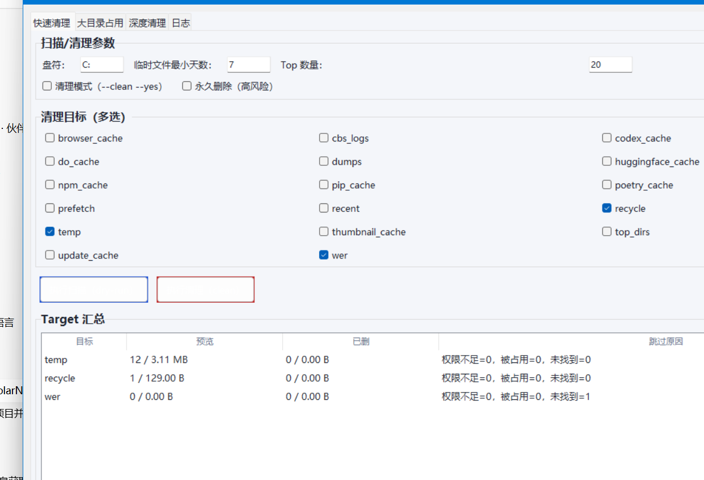
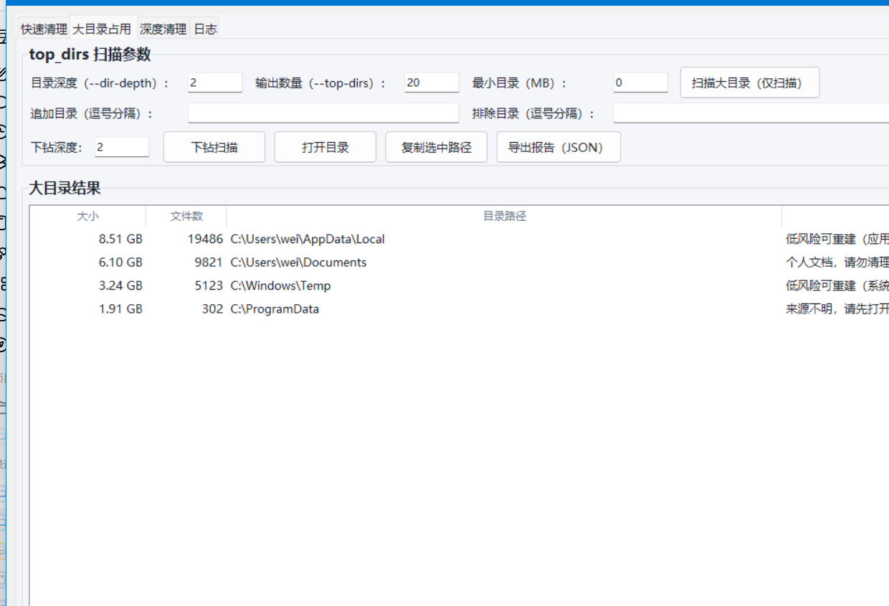

# clearc · Windows 磁盘清理与扫描工具

> 安全优先的 Windows 缓存清理 / 磁盘空间分析工具（**CLI + Tkinter GUI** 双模式）。
> 默认仅预览，只有显式确认才会删除；默认删除进回收站，可恢复。



## ✨ 功能特性

- **16 类清理目标**：temp / recycle / wer / dumps / do_cache / update_cache / browser_cache / pip_cache / npm_cache / thumbnail_cache / recent / prefetch / cbs_logs / huggingface_cache / codex_cache / poetry_cache；
- **深度清理（WinSxS / DISM）**：Analyze / Clean / ResetBase，含风险提示与双重确认；
- **大目录占用分析（top_dirs）**：只统计不删除，支持下钻扫描，识别常见缓存目录并给中文建议；
- **磁盘空间统计**：报告清理前后盘符可用空间与真实释放量；
- **安全兜底**：删除进回收站（`send2trash` / Windows Shell API 双通道），**绝不静默永久删除**；
- **双模式**：命令行 `python -m clearc` 与图形界面 `python -m clearc.gui` 一致可用。

> 当前版本：`v1.4.0` ｜ Python ≥ 3.9 ｜ Windows 10/11

## 📸 界面预览

**快速清理（Tab1）**——多选目标、dry-run/clean 一键执行，表格展示预览与跳过原因：


**大目录占用（Tab2）**——定位磁盘空间占用来源，只扫描不删除（下图为示例数据）：



> 说明：第二张图的表格为**示例数据**，仅用于展示界面形态；实际使用中为真实扫描结果。

## 🚀 快速开始

### 源码运行

```bash
# 1. 安装依赖（建议在虚拟环境中）
set PYTHONUTF8=1
python -m pip install -r requirements.txt

# 2. CLI：默认 dry-run（仅预览，不删除）
PYTHONPATH=src python -m clearc

# 3. GUI
PYTHONPATH=src python -m clearc.gui
```

### CLI 常用示例

```bash
# 仅预览 temp/recycle 两个目标
PYTHONPATH=src python -m clearc --targets temp,recycle --dry-run

# 真正清理（需确认 + 回收站可恢复）
PYTHONPATH=src python -m clearc --targets temp,recycle --clean --yes

# 清理大目录（top_dirs 只扫描不删除）
PYTHONPATH=src python -m clearc --targets top_dirs --dry-run --dir-depth 2 --top-dirs 20

# 输出 JSON 报告
PYTHONPATH=src python -m clearc --targets temp --dry-run --json report.json
```

### CLI 参数一览

| 参数 | 说明 | 默认 |
|---|---|---|
| `--targets` | 清理目标列表，逗号分隔 | `temp,recycle,wer` |
| `--dry-run` | 仅扫描/预览（默认） | 开 |
| `--clean` | 执行清理（需配合 `--yes`） | 关 |
| `--yes` | 确认清理，缺少则 `--clean` 直接退出 | 关 |
| `--permanent-delete` | 永久删除（不进回收站，高风险） | 关 |
| `--older-than-days` | temp 目标的时间阈值（天） | 7 |
| `--top` | Top 结果展示数量 | 20 |
| `--drive` | 目标盘符 | `C:` |
| `--json` | 报告输出为 JSON 文件 | 无 |
| `--dir-depth` | top_dirs 扫描目录深度 | 2 |
| `--top-dirs` | top_dirs 返回目录数量 | 20 |
| `--include-dirs` / `--exclude-dirs` | 追加 / 排除扫描目录（逗号分隔） | 无 |
| `--min-dir-size-mb` | top_dirs 最小目录体积（MB） | 0 |
| `--version` | 显示版本 | - |

## 🖥 GUI 分页结构

GUI 使用 `ttk.Notebook` 四个分页，避免单页过长：

- **Tab1 快速清理**：targets 多选、`dry-run/clean` 按钮、Target 汇总表格、Top 文件列表；
- **Tab2 大目录占用**：`top_dirs` 专用参数、扫描 + 下钻扫描、结果表格（大小可排序，支持复制/打开路径、导出 JSON）；
- **Tab3 深度清理**：WinSxS / DISM（Analyze / Clean / ResetBase）、风险提示与 ResetBase 双重确认、结构化结果 + 原始输出开关；
- **Tab4 日志**：集中展示 stdout/stderr/DISM 日志，支持一键清空、一键复制。

所有主表格/文本框均提供垂直滚动条、鼠标滚轮滚动，且支持窗口缩放。

## 🎨 GUI 交互优化（v1.4.0）

- **统一主题配色**：语义色分层（主操作=蓝、危险=红、警告=橙、成功=绿）；
- **底部状态栏**：实时显示「就绪 / 任务执行中 / 扫描完成 / 扫描失败」，颜色随状态变化；
- **悬浮提示（Tooltip）**：悬停按钮/危险选项即显示作用与风险说明；
- **危险操作高亮**：clean、永久删除、ResetBase 红色样式 + 执行前二次确认；
- **失败与空状态引导**：错误弹窗给出具体解决方式，不只报错不指引。

## 🛡 安全设计

- **默认 dry-run**：只有显式 `--clean --yes` 才真正删除；
- **默认回收站**：优先 `send2trash`，未安装时回退 Windows Shell API（`SHFileOperationW` + `FOF_ALLOWUNDO`），**绝不静默永久删除**；
- **系统级目标保护**：`dumps/do_cache/update_cache/prefetch/cbs_logs` 在 `--clean` 模式下必须管理员；
- **top_dirs 只读**：永远只扫描与提示，不会自动删除目录；
- **ResetBase 双重确认**：需勾选风险说明 + 输入 `RESETBASE` 才可执行。

## 🔐 管理员运行

- **CLI**：在“以管理员身份运行”的终端中执行；
- **GUI**：点击界面「以管理员重新启动 GUI」（触发 UAC runas）；
- 深度清理页：Analyze 非管理员可执行；Clean / ResetBase 需要管理员权限。

## 🧪 测试

```bash
python -m unittest tests/test_help.py tests/test_dism_parse.py tests/test_top_dirs.py
# 或全部
python -m unittest discover -s tests
```

## 📦 打包为 Windows `.exe`

> PyInstaller 不能在 Linux/macOS 上直接产出 Windows `.exe`，请在 Windows 环境执行。

```bat
scripts\build_windows_exe.bat
```

产物：`dist\clearc.exe`（单文件、无控制台窗口、UAC 管理员提权、含图标）。

### 获取 exe

- **Actions Artifacts**：仓库 Actions → `Build Windows EXE` → 下载 `clearc-windows-exe`；
- **Releases**：仓库 Releases → 下载对应版本资源。

### SmartScreen 提示

首次运行若提示“未知发布者”：点击“更多信息”→“仍要运行”。

## 📁 项目结构

```
clearc/
├── src/clearc/
│   ├── cli.py                  # CLI 入口与提示词
│   ├── gui.py                  # Tkinter GUI（v1.4.0 全面优化）
│   ├── scanner.py              # 目标定义与扫描/清理逻辑
│   ├── dism_component_store.py # WinSxS / DISM 深度清理
│   └── __main__.py             # python -m clearc
├── tests/                      # 单元测试
├── packaging/                  # PyInstaller 配置
├── scripts/                    # 构建脚本
└── docs/                       # 截图文档
```

## 📜 License

[MIT](LICENSE) © 2026 [zhangweiguo9719-web](https://github.com/zhangweiguo9719-web)

本软件按“现状”提供，不附带任何明示或默示的担保。可自由使用、修改、分发，但须保留原始版权声明。详见 [LICENSE](LICENSE) 全文。
